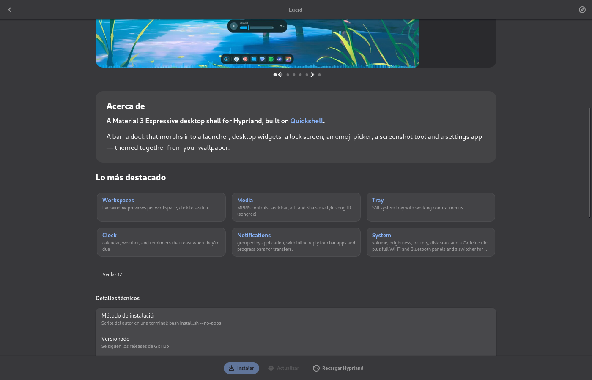
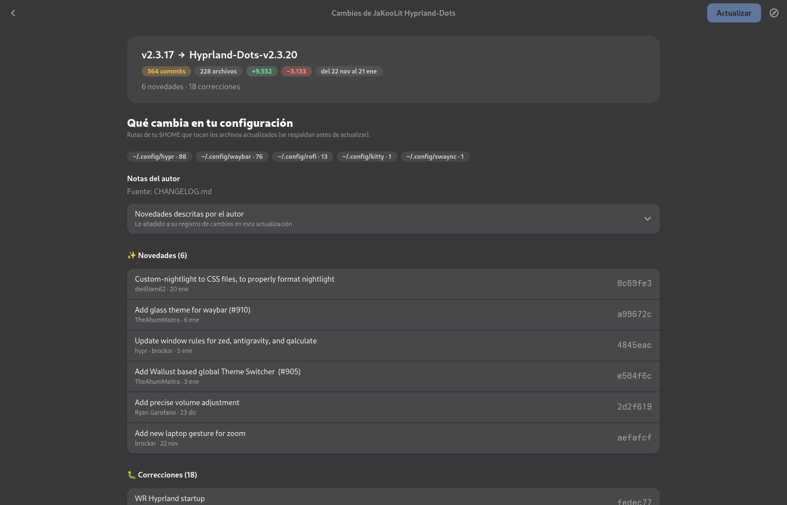
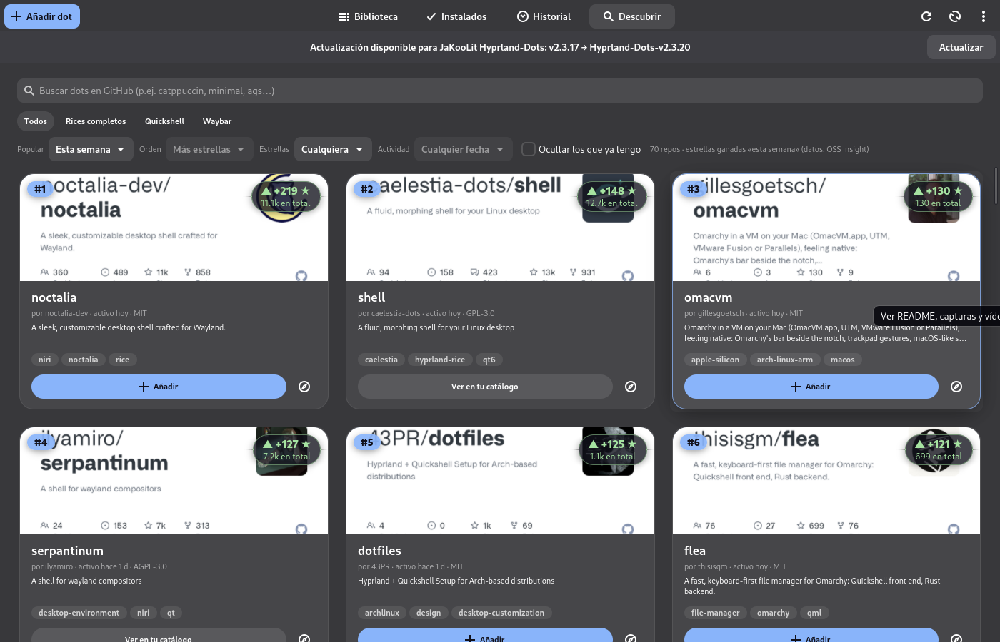
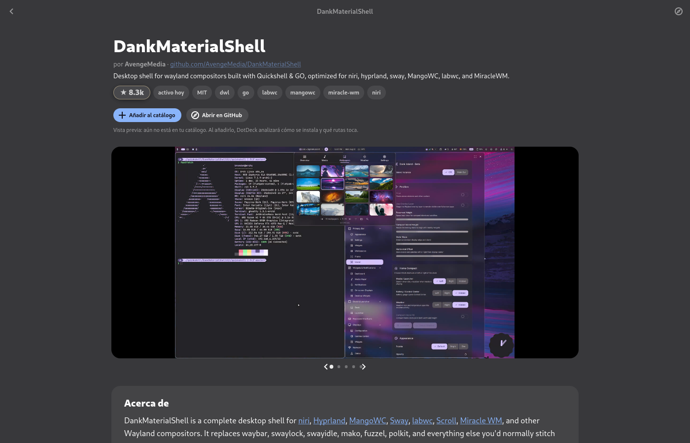
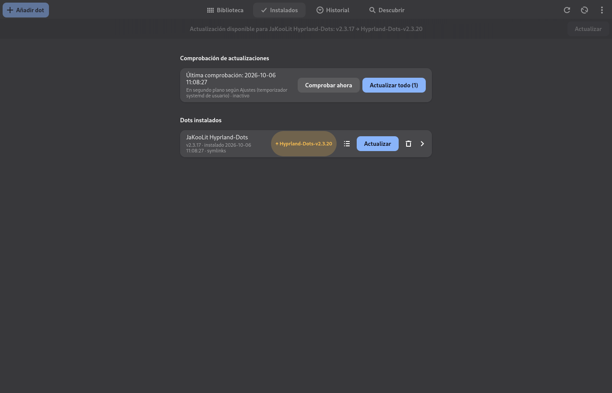
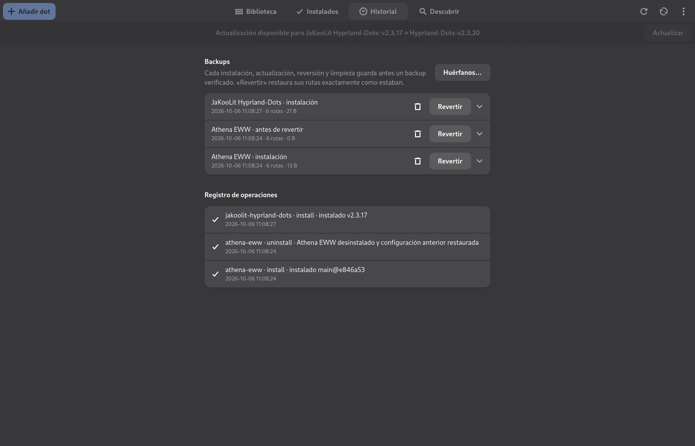
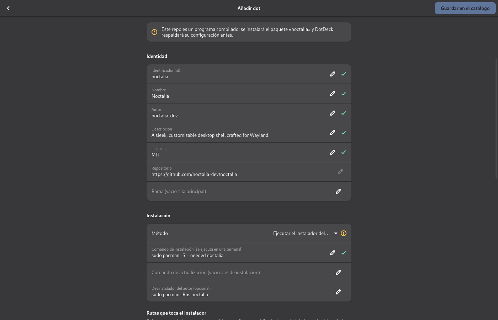

<p align="center"></p>

# 飾 DotDeck

[](https://github.com/madkyp/dotdeck/actions/workflows/tests.yml)


**A manager for Hyprland "dots" (rices) on Arch / CachyOS**, built with GTK4 / libadwaita.

DotDeck lets you **browse, preview, install, update, revert and clean up** third-party Hyprland setups — Caelestia, HyDE, Lucid, end-4, Noctalia… — without ever losing your own configuration. Every change is preceded by a **verified backup**, every file a dot creates is **recorded**, and reverting puts your `$HOME` back **exactly** as it was. It also **discovers** new dots on GitHub (with what's trending today, this week, this month or this year), shows **what an update changes** before you install it, and keeps an eye on updates in the background.

> The interface is in **Spanish** (the screenshots too).

> *DotDeck*: a deck of dotfiles — and the 飾 kanji means *decoration*, which is what a rice is.

> ⚠️ **Alpha version.** DotDeck works end to end on the author's machine (CachyOS + Hyprland 0.56 with the Lua config), but it is young software: expect rough edges and please report what breaks.

> 🤖 **This project was built with the help of AI.** See the [disclaimer](#-disclaimer) below.

---

## 📸 Screenshots

| Library | Dot page: gallery, README and actions |
|---|---|
|  |  |
| **A clean summary instead of the whole README** | **What an update changes, before installing it** |
|  |  |
| **Discover: trending dots on GitHub** | **Preview a repo before adding it** |
|  |  |
| **Installed, with update notice** | **History: every backup, one click to revert** |
|  |  |
| **Add a dot from a URL** (here Noctalia, detected as a package) | |
|  | |

---

## ✨ Features

### 📚 Library and preview
- A gallery of dots with covers, state (*installed*, *update available*) and origin (*initial list*, *added by you*).
- Each dot's page shows its **gallery** (screenshots and the **videos** authors embed in their README, playing muted in a loop), an **About** card, **Highlights** (feature tiles pulled from the README) and the full README **folded by sections** — not a wall of text.
- Images uploaded to GitHub as `user-attachments` (which return 404 without a browser session) are resolved through GitHub's signed links, so they load anyway.

### 🔎 Discover
- Searches GitHub for repositories tagged `hyprland` (no forks, no archived repos), with categories (**All**, **Full rices**, **Quickshell**, **Waybar**), text search and filters: **order**, **minimum stars**, **activity** and *hide the ones I already have*.
- **Popular**: *all time*, **today**, **this week**, **this month** or **this year** — ranked by **stars gained in that period** (GitHub no longer exposes when stars were given, so the daily star history comes from [OSS Insight](https://ossinsight.io)).
- Click a card to **preview** the repo (gallery, README, highlights) and **Add** it to your catalog in one click.

### ➕ Add any dot from its URL
Paste a repository URL (browser URLs like `…/tree/main#Installation` are fine) and DotDeck works out:
- the README and screenshots, how the author versions it (**releases**, **tags** or **commits**), the Hyprland config format (`hyprland.lua` vs `hyprland.conf`) and whether the repo is archived;
- **how it installs**: the author's installer (`install.sh`, `setup`…), the `.config/*` folders to link, or a **pacman / AUR package** (e.g. Noctalia);
- which paths the installer touches (by reading the script) and its dependencies.

Every field is marked ✔ *detected*, ? *review*, ✘ *missing* or ✎ *yours*; anything that can't be detected reliably is asked for instead of guessed. Added dots behave exactly like the initial ones, and can be edited or removed from the app.

### 🛡️ Install, update and revert — safely
- **Two install methods**:
  - **files** — the dot's folders are **symlinked** from a checkout (only the linked folders are downloaded, even from 900 MB repos), so DotDeck always knows what belongs to the dot and can tell when you edited one of its files;
  - **script** — the author's installer runs in a **visible terminal** (you type your sudo password there); DotDeck takes a snapshot before and after and records everything it created or changed.
- **Verified backups** before anything is touched: every path is copied and checked hash by hash; paths that didn't exist are recorded too, so restoring removes what the dot added. Not enough disk space → nothing happens.
- **Automatic rollback** if an installer fails. **Revert** any backup from the History page (the current state is backed up first, so reverting is reversible too) — verified in tests to leave `$HOME` byte-for-byte as it was.
- **Updates keep your edits**: local changes are re-applied on top of the new version, with a conflict prompt.
- **Asks for your sudo password** before installing, updating or reloading Hyprland (can be turned off), checks dependencies with `pacman -T` and shows the exact `pacman` / `yay` command for the missing ones.
- **Stuck installer watchdog**: if an installer hangs waiting for a background process it started itself (e.g. HyDE's theme switcher with `awww-daemon`), DotDeck notices after 20 s and offers to stop that process.
- After installing or updating: `hyprctl reload` + `hyprctl configerrors` check, and an offer to **reboot now or later**.

### 🔄 Updates
- A **systemd user timer** (`dotdeck-update-check.timer`) checks your installed dots and sends a notification; the app shows a banner with an **Update** button.
- **See changes** before updating: commits grouped by type (✨ features, 🐛 fixes, ⚡ performance…), files and lines changed, **which parts of your `$HOME` are affected**, and the author's notes (new `CHANGELOG` entries or release notes).

### 🏠 Adopts what you already have
Dots installed outside DotDeck can be **adopted** (`install.existing`). **HyDE** in `~/HyDE` is detected and followed: updates use HyDE's own official steps (`git fetch` + `reset --hard` + `./install.sh -r`) with a full verified backup first, and DotDeck never deletes your clone.

### 🧹 Orphans
Removes leftovers from dots that are no longer installed — **only** paths recorded in DotDeck's own ledger and still exactly as DotDeck left them. Never by name or pattern; anything uncertain is listed and left alone.

---

## 📦 Install

```sh
git clone https://github.com/madkyp/dotdeck.git
cd dotdeck
makepkg -si
```

Dependencies: `python` (3.11+), `python-gobject`, `gtk4`, `libadwaita`, `python-markdown`, `git`, `libnotify`. Optional: `kitty` (or ghostty / alacritty / foot) for installers, `yay` or `paru` for AUR dependencies, and the GitHub CLI (`gh auth login`) to raise GitHub's API limit from 60 to 5000 requests per hour.

To try it without installing: `PYTHONPATH=. python3 -m dotdeck`.

## 🚀 Getting started

1. Open **DotDeck** from your launcher (or run `dotdeck`).
2. **Library** → pick a dot → read its page → **Instalar**. DotDeck checks dependencies, shows what will be replaced, backs it up and applies the dot.
3. **Discover** → find new dots → click to preview → **Añadir**.
4. **Ajustes → Actualizaciones** → enable the background update check.
5. To undo anything: **Historial** → choose a backup → **Revertir**.

## ⌨️ Command line

```sh
dotdeck list                         # catalog and state
dotdeck install ID [--ref TAG]       # install (with backup)
dotdeck update ID [--keep-local]     # update
dotdeck uninstall ID [--no-restore]  # uninstall, restoring your previous config
dotdeck backups | restore BACKUP_ID  # history and revert
dotdeck orphans [--clean]            # find / remove recorded leftovers
dotdeck add URL                      # analyse a repo and add it to the catalog
dotdeck check-updates [--notify]
dotdeck --debug                      # log every file operation
```

## 📝 Dot definitions

One TOML file per dot. The initial catalog lives in [`dots.d/`](dots.d); dots you add go to `~/.config/dotdeck/dots.d/` (a file with the same `id` overrides the initial one). The format is documented, field by field, in [`docs/dot-format.toml`](docs/dot-format.toml):

```toml
id = "athena-eww"
name = "Athena EWW"
repo = "https://github.com/haikal-hakim/athena-eww"

[track]
mode = "commit"          # release | tag | commit

[install]
method = "files"         # files (symlinks) | script (author's installer)

[[install.links]]
src = ".config/eww"
dest = "~/.config/eww"

[deps]
pacman = ["eww", "socat"]
```

### Initial catalog

| Dot | Method | Notes |
|---|---|---|
| [Caelestia Shell](https://github.com/caelestia-dots/shell) | AUR package | releases |
| [Caelestia AW](https://github.com/AdiAmbassador/caelestia-aw) | author's patch | animated wallpapers for Caelestia |
| [HyDE](https://github.com/HyDE-Project/HyDE) | author's installer | adopts `~/HyDE` |
| [Lucid](https://github.com/Sn3akyy1/lucid) | author's installer | `--no-apps` |
| [Wrayth](https://github.com/bowenbride/wrayth) | author's installer | Hyprland Lua config |
| [Serpantinum](https://github.com/ilyamiro/serpantinum) | author's installer | |
| [Brain Shell](https://github.com/Brainitech/Brain_Shell) | author's installer | |
| [Rhythm](https://github.com/rhythmcreative/hyprland) | author's installer | touches system files |
| [mkbula dotfiles](https://github.com/mkbula/dotfiles) | author's installer | archived upstream |
| [Surface Dots](https://github.com/snes19xx/surface-dots) | symlinks | |
| [Athena EWW](https://github.com/haikal-hakim/athena-eww) | symlinks | |
| [JaKooLit Hyprland-Dots](https://github.com/JaKooLit/Hyprland-Dots) | symlinks | temporary test example |

## 📁 Files

| Path | What |
|---|---|
| `~/.config/dotdeck/dots.d/` | your dots (and `covers/`) |
| `~/.config/dotdeck/settings.json` | settings |
| `~/.local/state/dotdeck/installed/` | one manifest per installed dot |
| `~/.local/state/dotdeck/backups/` | backups, each with a `manifest.json` |
| `~/.local/state/dotdeck/ledger.jsonl` | every path DotDeck ever created (basis of orphan cleanup) |
| `~/.local/state/dotdeck/history.jsonl` · `dotdeck.log` | history and log |
| `~/.local/share/dotdeck/deploy/` | checkouts the symlinks point to |
| `~/.cache/dotdeck/` | README previews, images, star history |

## 🧪 Tests

```sh
python3 -m unittest discover -s tests -p 'test_*.py' -t .   # fast, offline (CI)
python3 tests/e2e.py                                        # end to end, sandboxed $HOME, real repos
python3 tests/verify_catalog.py                             # dry check of every dot in the catalog
```

The end-to-end suite runs with `HOME` and `XDG_*` pointed at a temporary sandbox and never installs packages: it installs, updates, reverts and uninstalls real dots and checks that `$HOME` ends up **identical** to how it started (hash of every file), plus failing installers, orphans, adopted installs, conflicts and errors.

## 🤖 Disclaimer

This project was created **with the help of AI** (Anthropic's Claude, through Claude Code). The code was written together with the AI, then reviewed, tested (see [Tests](#-tests)) and used on a real CachyOS + Hyprland system, but:

- It is an **alpha** and is provided **as is**, without warranty of any kind (see the [license](LICENSE)).
- It replaces configuration files in your `$HOME` and runs third-party installers. Backups and reverts are designed to be exact, but keep your own backups of anything important. What an author's installer changes **outside `$HOME`** (packages, `/etc`, display manager, `gsettings`) is not covered by DotDeck's backups.

DotDeck is an independent project, **not affiliated with any of the dots it lists**. Every dot, its screenshots and its artwork belong to their authors; the covers in `dots.d/covers` are screenshots of each project (from its repository, README or demo video), used only to identify them.

Found a bug or something that looks wrong? Please open an issue.

---

## License

MIT
